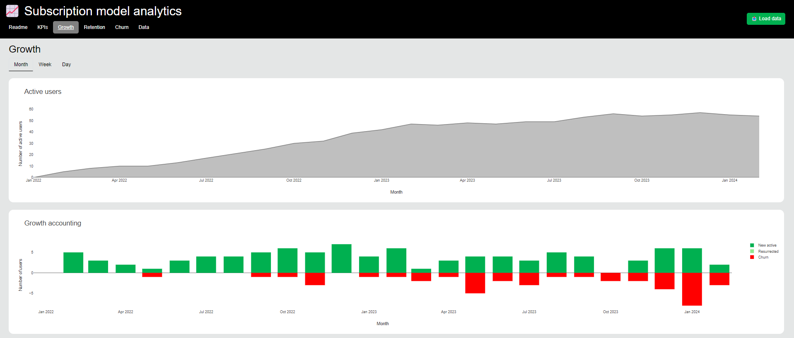

# subscription-model-analytics
Analytics framework for subscription model data.

### Overview
This dashboard will help you analyse useful metrics for subscription-based product.

#### Load data
Using the `Load data` button, upload a csv filw with the following columns:
- `user_id`: the unique ID of a customer
- `subscription_id`: the unique ID of a subscription
- `start_date`: the start date of the subscription (format `YYYY-MM-DD`)
- `end_date`: the end date of the subscription (format `YYYY-MM-DD`, empty if the subscription is currently active)

#### KPIs
This section will show big picture indicators about currently active, new and churn users.

#### Growth
In this section, we will show the evolution of net number of active users over time, as well as the growth accounting (new, resurrected and churn).  

#### Retention
This section will show the number of active users over time split by cohort (based on the start date), as well as retention heatmaps.

#### Churn
Here we will focus on churn, with total number of churn by time period and churn as a percentage of active users at the end of previous period.

#### Data
This section will allow you to navigate into the input data. 

### Next steps
- Retention model
- LTV
- KPIs in %